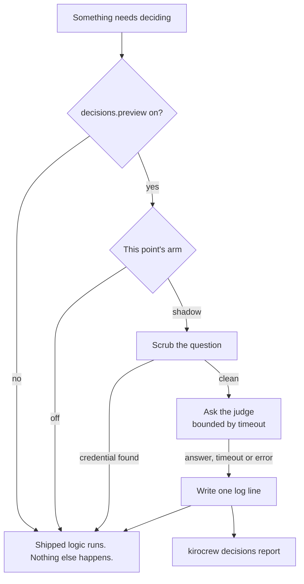

# Decision preview

Kiro Crew makes a lot of small judgement calls on your behalf. Which skills are relevant to what you just typed. Whether tonight's cron result actually says anything new. Whether two extracted skills are the same skill. Each of those is decided today either by a fixed rule with a threshold in it, or by asking a full language model and paying for a whole turn.

Neither answer is satisfying. A threshold is free but blunt, and the number in it was picked once and never revisited against your traffic. A model call is sharp but costs a second and a fraction of a cent every time, which is why the cheap rule is still doing most of this work.

**The ask:** could a small, fast judge do these calls better than the threshold and cheaper than the model? **The problem:** there is no honest way to answer that from the outside. The only traffic that matters is yours, and the only way to know whether a judge would have been right is to watch it answer the same questions your install is really asking.

**The workaround this replaces:** switch the logic over, use it for a week, and notice afterwards if anything got worse. That is a bad trade — you find out by being wrong.

Decision preview is the honest version. It asks the judge the same question, at the same moment, on your real traffic, and then throws the answer away and keeps the receipt. Nothing your session does changes. Later you read the receipts and decide whether the judge was ever worth trusting.

## What a decision point is

A decision point is one named place in Kiro Crew where a judgement is made and where a second opinion can be asked without disturbing anything. It has a name (`skills.select`), a question, the answer the shipped logic gave (the *baseline*), and a rule for whether the second opinion agreed with that baseline.

Three ship in this release, all off:

| Point | The question it asks | Baseline it is compared against |
|---|---|---|
| `skills.select` | Which of these skills are relevant to this message? | The trigger matcher's selected skills, when all fit the offered menu |
| `skills.dedupe` | Is this extracted skill new, a duplicate, or an update? | The final model-or-lexical verdict |
| `cron.novelty` | Does this cron result say anything new against the last one? | A confirmed delivery after the result hash changed |

## What shadow means

Shadow is the whole point of the feature: the answer is recorded and then discarded. The skill list you get, the dedupe verdict, and the cron delivery are byte-for-byte what they would be on a build without this feature. The only difference is one more line in a log file.

An arm of `off` means the question is not even asked, and no network call happens. `live` exists in the config schema and is validated, but no point in this release consumes it — a point that actually acted on the answer would need its own release, its own latency budget, and its own review.



Note where the shipped logic sits in that picture: on every path. It is never waiting on the judge and never affected by it.

## Turning it on

Two switches, and both must be set. The feature-wide one lives in `config.json` as `decisions.preview`, and each point has its own `arm`:

```json
{
  "decisions": {
    "preview": true,
    "points": {
      "skills.select": { "arm": "shadow", "impl": "llm", "bucket": 100 }
    }
  }
}
```

`impl` chooses who answers. It defaults to `llm`, the comparison lane exercised in CI; `jev` is an explicit opt-in until its real endpoint mapping has been exercised with an API key. Both implementations accept the shipped question vocabulary (`Choice` and `Noul`). `bucket` is a percentage of sessions, so `bucket: 10` samples a tenth of them and leaves the rest untouched. Settings carries a card for the feature-wide switch; the per-point arms are config values. The loader warns when it sees `arm: live`, because no point consumes a live answer in this release, but preserves the value rather than rewriting operator intent.

Both switches default to off, and the ceiling is deliberately the config file rather than a browser flag — the switch has to be readable by the part of Kiro Crew that would make the call, and that part never sees your browser.

## Before you turn it on: the question leaves your machine

This is the risk worth reading twice. When a point is armed, the question is sent to whoever answers it, which for a hosted judge means your text leaves this machine.

What is in the question, per point: for `skills.select`, the message you just typed and the skill descriptions; for `skills.dedupe`, the candidate skill text; for `cron.novelty`, that job's last result. Memory contents and file diffs are not in any of them. Before a request leaves the machine, the whole state is scanned for credentials and exfiltration-shaped URLs; either kind of hit cancels the call rather than sending a redacted version. The log distinguishes `scrubbed: credential` from `scrubbed: exfiltration-url`, and scanner failures refuse too. A `secret://` API key is resolved only for the default provider endpoint; a custom endpoint requires a literal key in config.

That is still your text going somewhere. Arm a point only if those three kinds of content are allowed to leave this machine.

## Where the log lives

One file per UTC day, under your Kiro Crew data home:

```
~/.kiro/crew/decisions/decisions-20260917.jsonl
```

One JSON object per line, one line per call. It holds the timestamp, the point, the arm, who answered, a hashed session id, latency, cost, whether the request was scrubbed, the answers with the confidence claimed for each, the baseline, and whether the two agreed. `KIROCREW_HOME` moves the directory the same way it moves everything else.

Both halves make the same promise about these files: a day-file is a regular file this install wrote. The writer will not append through a symlink, and the report will not read one — an entry planted under a log name, whether a link, a FIFO or a device, is named as unreadable and skipped rather than followed.

Nothing prunes these files, so a long soak on a busy install is worth an occasional look — and worth deleting once you have read the report, since the log is the one place the questions are written down.

## Reading the report

```
kirocrew decisions report --since 7d
```

`--point skills.select` narrows it to one point, `--json` gives you the same numbers as data, and an empty log answers with one friendly line instead of an error, because a preview nobody enabled is the normal state.

The top table is one row per point and implementation:

```
POINT          IMPL  N   AGREE  JUDGED  ABSTAIN  ERROR  SCRUBBED  P50  P95  COST
-------------  ----  --  -----  ------  -------  -----  --------  ---  ---  -------
skills.select  jev   84  91%    80      2%       3%     1         212  480  0.00671
```

`AGREE` is how often the judge matched the shipped baseline, counted only over the calls where a comparison was possible — `JUDGED` is that count, and it is normally smaller than `N`. `ABSTAIN` is calls that came back with no answer and no error, which is the judge declining rather than failing; `ERROR` is timeouts and refusals, kept separate because they mean different things. `P50` and `P95` are milliseconds; a p95 near your timeout means the judge is mostly timing out rather than mostly answering.

Then a calibration curve per group, which is the number that decides whether a judge is usable:

```
CONFIDENCE  N   AGREE
----------  --  -----
0.5-0.6     4   50%
0.6-0.7     9   67%
0.7-0.8     12  75%
0.8-0.9     21  86%
0.9-1.0     34  97%
```

Read it as a promise and a scorecard. Each row is the calls where the judge claimed roughly that much confidence, and `AGREE` is how often it was right at that confidence. A judge whose numbers mean something climbs down the left column and up the right: when it says 0.95, it is right about 95% of the time. A curve that is flat — 60% agreement whether it claimed 0.55 or 0.99 — tells you the confidence is decoration, and a point on that judge could never be promoted safely no matter how good the headline agreement rate looked.

High agreement with a flat curve is the trap this table exists to catch.

## What it does not do

It does not change a decision, so a bad answer in the log cost you nothing but the line it is written on. It does not retry, so a timeout is recorded as a timeout. And it does not judge itself: the report shows you the evidence, and whether a point graduates off `shadow` stays a decision a person makes.
